# ARCHITECTURE.md — ZeroClaw System Architecture

## High-Level Architecture

```mermaid
graph TB
    subgraph "User Interface Layer"
        CLI[CLI Channel]
        TG[Telegram]
        DC[Discord]
        SL[Slack]
        WA[WhatsApp]
        MX[Matrix]
        EM[Email]
        IRC_CH[IRC]
        MM[Mattermost]
        DT[DingTalk]
        LK[Lark]
        QQ_CH[QQ]
        IM[iMessage]
        SIG[Signal]
        GW[HTTP Gateway]
    end

    subgraph "Agent Core"
        AG[Agent Orchestrator]
        CL[Query Classifier]
        PM[Prompt Builder]
        ML[Memory Loader]
        DP[Tool Dispatcher]
    end

    subgraph "Provider Layer"
        AN[Anthropic]
        OA[OpenAI]
        GM[Gemini]
        OL[Ollama]
        OR[OpenRouter]
        CP[Copilot]
        GL[GLM]
        OX[Codex]
        CM[Compatible]
        RL[Reliable Wrapper]
        RT[Router]
    end

    subgraph "Tool Layer"
        SH[Shell]
        FR[File Read]
        FW[File Write]
        BR[Browser]
        HR[HTTP Request]
        WS[Web Search]
        MS[Memory Store]
        MR[Memory Recall]
        GI[Git Ops]
        SC[Schedule]
        DL[Delegate]
        CR[Cron Tools]
        HW[Hardware Tools]
    end

    subgraph "Memory Layer"
        SQ[SQLite + FTS5 + Vector]
        MD[Markdown Files]
        PG[PostgreSQL]
        EM_P[Embeddings]
        RC[Response Cache]
        HY[Hygiene/Prune]
        SN[Snapshot]
    end

    subgraph "Security Layer"
        SP[Security Policy]
        PA[Pairing]
        SE[Secret Store]
        AU[Audit Log]
        SB[Sandbox Detection]
        LL[Landlock]
        FJ[Firejail]
        BW[Bubblewrap]
        DK_SB[Docker Sandbox]
    end

    subgraph "Infrastructure"
        OB[Observability]
        HB[Heartbeat]
        DA[Daemon]
        CS[Cost Tracker]
        CJ[Cron Scheduler]
        TN[Tunnel]
        SV[Service Manager]
    end

    subgraph "Hardware Layer"
        PH[Peripherals]
        RP[RPi GPIO]
        SR[Serial]
        AF[Arduino Flash]
        NF[Nucleo Flash]
        HD[Hardware Discovery]
    end

    CLI & TG & DC & SL & WA & MX & EM & IRC_CH & MM & DT & LK & QQ_CH & IM & SIG & GW --> AG
    AG --> CL
    AG --> PM
    AG --> ML
    AG --> DP
    DP --> SH & FR & FW & BR & HR & WS & MS & MR & GI & SC & DL & CR & HW
    AG --> RL
    RL --> RT
    RT --> AN & OA & GM & OL & OR & CP & GL & OX & CM
    ML --> SQ & MD & PG
    MS & MR --> SQ & MD & PG
    SQ --> EM_P
    SH --> SP
    SP --> SB
    SB --> LL & FJ & BW & DK_SB
    DA --> GW & HB & CJ
    HW --> PH
    PH --> RP & SR & AF & NF
    HD --> PH
```



## Component Breakdown

### 1. Agent Core (`src/agent/`)

The agent orchestrator is the central brain. It:

1. Receives a user message from any channel
2. Loads memory context via `MemoryLoader`
3. Builds a system prompt via `PromptBuilder` (identity, tools, safety, skills, workspace, runtime)
4. Classifies the query via `Classifier` for model routing hints
5. Sends the enriched message to the `Provider` (via `ReliableProvider` wrapper)
6. Processes the response through the `ToolDispatcher`:
   - If text only → return to user
   - If tool calls → execute tools → loop back to provider with results
7. Continues until max iterations reached or provider returns text-only response
8. Auto-saves conversation to memory if enabled

**Key types:**
- `Agent` — main orchestrator struct
- `AgentBuilder` — fluent construction
- `ToolDispatcher` trait — XML or Native dispatch
- `MemoryLoader` trait — memory context injection
- `PromptSection` trait — pluggable prompt sections

### 2. Providers (`src/providers/`)

Each provider implements the `Provider` trait with methods:
- `chat_with_system()` — simple chat with system prompt
- `chat_with_history()` — multi-turn conversation
- `chat_with_tools()` — tool-calling with schema
- `stream_chat_with_history()` — streaming responses
- `supports_native_tools()` — capability flag

**Provider hierarchy:**
```
Provider trait
├── AnthropicProvider (Claude API, caching, OAuth)
├── OpenAiProvider (Chat Completions API)
├── OpenAiCodexProvider (Responses API, device-code OAuth)
├── OllamaProvider (local/cloud, quirky tool parsing)
├── GeminiProvider (multi-auth: API key, OAuth, ADC)
├── GlmProvider (JWT auth, token caching)
├── CopilotProvider (GitHub device-code OAuth, token refresh)
├── OpenRouterProvider (multi-model aggregator)
├── CompatibleProvider (OpenAI-compatible endpoints)
├── ReliableProvider (retry, fallback, error handling wrapper)
└── RouterProvider (hint-based multi-provider routing)
```

### 3. Channels (`src/channels/`)

Each channel implements the `Channel` trait:
- `send()` — send message to user
- `listen()` — receive messages (polling or webhook)
- `health_check()` — connectivity check
- `supports_typing()` / `send_typing()` — typing indicators
- `supports_draft_updates()` — progressive message updates

**15 channel implementations** covering major chat platforms plus CLI, email, and IRC.

### 4. Tools (`src/tools/`)

Each tool implements the `Tool` trait:
- `name()` / `description()` / `parameters_schema()` — metadata
- `execute()` — run the tool and return `ToolResult`

**Security layers per tool:**
1. `SecurityPolicy` — autonomy level check (read-only, supervised, full)
2. `ActionTracker` — sliding-window rate limiting
3. Path validation — workspace containment, symlink escape prevention
4. Input sanitization — command injection blocking, null byte rejection
5. Output truncation — prevent OOM from large outputs

### 5. Memory (`src/memory/`)

**Backend hierarchy:**
```
Memory trait
├── SqliteMemory (FTS5 full-text + vector cosine similarity)
│   └── EmbeddingProvider (OpenAI embeddings for semantic search)
├── MarkdownMemory (append-only markdown files)
├── PostgresMemory (distributed, ILIKE keyword search)
├── NoneMemory (no-op for testing)
└── LucidMemory (external lucid-memory CLI bridge)
```

**Memory pipeline:**
```
Store → Category routing → Backend write → Embedding generation (async)
Recall → Keyword search + Vector search → Hybrid merge (BM25 + cosine) → Scored results
```

### 6. Security (`src/security/`)

**Defense-in-depth layers:**
1. **AutonomyLevel** — ReadOnly, Supervised, Full
2. **SecurityPolicy** — forbidden paths, allowed commands, rate limits
3. **CommandRiskLevel** — Low, Medium, High classification
4. **Sandbox** — Landlock > Firejail > Bubblewrap > Docker > NoopSandbox
5. **Secret Store** — ChaCha20-Poly1305 AEAD encryption at rest
6. **Pairing** — one-time codes + SHA-256 token hashing + brute-force lockout
7. **Audit** — structured event logging (UUID, timestamp, actor, action, result)

### 7. Gateway (`src/gateway/`)

Axum HTTP server with:
- Request body size limit (65KB)
- Request timeout (30s)
- Sliding-window rate limiting
- Bearer token authentication (paired tokens)

### 8. Observability (`src/observability/`)

**Observer implementations:**
```
Observer trait
├── LogObserver (tracing crate)
├── VerboseObserver (detailed logging)
├── NoopObserver (zero-overhead)
├── MultiObserver (fan-out composite)
├── OtelObserver (OpenTelemetry OTLP)
└── PrometheusObserver (metrics exposition)
```

### 9. Runtime (`src/runtime/`)

**Runtime adapters:**
```
RuntimeAdapter trait
├── NativeRuntime (full OS access)
├── DockerRuntime (containerized, workspace mount)
└── WasmRuntime (stub, not yet implemented)
```

### 10. Infrastructure

- **Daemon** (`src/daemon/`) — process supervisor with exponential backoff
- **Heartbeat** (`src/heartbeat/`) — periodic alive signals
- **Cost Tracker** (`src/cost/`) — token usage and budget management
- **Cron Scheduler** (`src/cron/`) — recurring task scheduling with persistence
- **Tunnel** (`src/tunnel/`) — ngrok, Cloudflare, Tailscale, custom tunnels
- **Service** (`src/service/`) — systemd/launchd integration
- **Health** (`src/health/`) — component health tracking

---

## Data Flow Diagrams

### Agent Turn Flow
```
User Message
    │
    ▼
┌─────────────┐
│ Memory Load │ ← recall(message, limit=5, min_score=0.4)
└──────┬──────┘
       │ context
       ▼
┌──────────────┐
│ Prompt Build │ ← Identity + Tools + Safety + Skills + Workspace + DateTime + Runtime
└──────┬───────┘
       │ system_prompt
       ▼
┌──────────────┐
│  Classifier  │ ← keywords/patterns → model hint
└──────┬───────┘
       │ hint
       ▼
┌──────────────┐
│   Provider   │ ← ChatRequest{system, messages, tools, model, temperature}
└──────┬───────┘
       │ ChatResponse{text?, tool_calls?}
       ▼
┌──────────────────┐
│ Tool Dispatcher  │ ← if tool_calls: execute each tool
│  (loop ≤ max)    │    format results → send back to provider
└──────┬───────────┘
       │ final text
       ▼
┌──────────────┐
│ Channel.send │ → User
└──────────────┘
```

### Security Flow
```
Shell Command Request
    │
    ▼
┌──────────────────┐
│ Autonomy Check   │ ← ReadOnly blocks execution
└──────┬───────────┘
       ▼
┌──────────────────┐
│ Rate Limit Check │ ← ActionTracker sliding window (1hr)
└──────┬───────────┘
       ▼
┌──────────────────┐
│ Command Classify │ ← Low/Medium/High risk assessment
└──────┬───────────┘
       ▼
┌──────────────────┐
│ Approval Check   │ ← Medium: ask user; High: block
└──────┬───────────┘
       ▼
┌──────────────────┐
│ Env Sanitization │ ← Only safe vars: PATH, HOME, TERM, LANG
└──────┬───────────┘
       ▼
┌──────────────────┐
│ Sandbox Wrap     │ ← Landlock/Firejail/Bubblewrap/Docker
└──────┬───────────┘
       ▼
┌──────────────────┐
│ Execute + Audit  │ ← output truncation (1MB), timeout (60s)
└──────────────────┘
```

---

## Database Schema

### SQLite Memory (`memory.db`)

```sql
CREATE TABLE IF NOT EXISTS memories (
    id TEXT PRIMARY KEY,
    key TEXT NOT NULL,
    content TEXT NOT NULL,
    category TEXT NOT NULL DEFAULT 'core',
    session_id TEXT,
    created_at TEXT NOT NULL,
    updated_at TEXT NOT NULL,
    embedding BLOB  -- f32 vector serialized as little-endian bytes
);

CREATE VIRTUAL TABLE IF NOT EXISTS memories_fts USING fts5(
    key, content,
    content='memories',
    content_rowid='rowid'
);

CREATE TABLE IF NOT EXISTS embedding_cache (
    text_hash TEXT PRIMARY KEY,
    embedding BLOB NOT NULL,
    created_at TEXT NOT NULL
);
```

### PostgreSQL Memory

```sql
CREATE TABLE IF NOT EXISTS memories (
    id TEXT PRIMARY KEY,
    key TEXT NOT NULL,
    content TEXT NOT NULL,
    category TEXT NOT NULL DEFAULT 'core',
    session_id TEXT,
    created_at TIMESTAMPTZ NOT NULL DEFAULT NOW(),
    updated_at TIMESTAMPTZ NOT NULL DEFAULT NOW()
);

CREATE INDEX IF NOT EXISTS idx_memories_key ON memories(key);
CREATE INDEX IF NOT EXISTS idx_memories_updated ON memories(updated_at);
CREATE INDEX IF NOT EXISTS idx_memories_category ON memories(category);
```

---

## Configuration Architecture

```toml
# config.toml top-level keys
[agent]                 # max_tool_iterations, max_history, dispatcher
[identity]              # AIEOS/OpenClaw identity format
[autonomy]              # level (read_only/supervised/full)
[memory]                # backend, embeddings, hygiene, snapshot
[channels.telegram]     # bot_token, allowed_users, polling_interval
[channels.discord]      # bot_token, guild_id, allowed_users
[channels.slack]        # bot_token, allowed_users
# ... (15 channel configs)
[security]              # sandbox, secrets, pairing
[gateway]               # bind_address, port, rate_limit
[observability]         # backend (log/otel/prometheus/noop)
[runtime]               # adapter (native/docker/wasm)
[cost]                  # budget, tracking
[heartbeat]             # interval, message
[scheduler]             # enabled, timezone
[hardware]              # transport, serial_port, baud_rate
[peripherals]           # boards list
[tunnel]                # provider (ngrok/cloudflare/tailscale)
[delegate]              # sub-agent configurations
[proxy]                 # HTTP proxy per service
[reliability]           # retry, fallback, timeout
[storage]               # provider-specific storage
[resource_limits]       # memory, CPU, disk
```

---

## API / Gateway Endpoints

| Method | Path | Auth | Description |
|--------|------|------|-------------|
| POST | `/webhook` | Bearer token | Receive webhook messages |
| POST | `/gateway/message` | Bearer token | Send message to agent |
| GET | `/health` | None | Health check |
| GET | `/status` | Bearer token | Component status |

---

## Third-Party Integrations

| Service | Protocol | Auth | Purpose |
|---------|----------|------|---------|
| Anthropic API | HTTPS REST | Bearer token / OAuth | Claude LLM |
| OpenAI API | HTTPS REST | Bearer token | GPT models |
| Google Gemini | HTTPS REST | API key / OAuth / ADC | Gemini models |
| Zhipu GLM | HTTPS REST | JWT (HMAC-SHA256) | GLM models |
| GitHub Copilot | HTTPS REST | Device-code OAuth | Copilot models |
| OpenRouter | HTTPS REST | Bearer token | Multi-model routing |
| Ollama | HTTPS REST | None (local) | Local models |
| Telegram Bot API | HTTPS REST | Bot token | Messaging |
| Discord Gateway | WebSocket | Bot token | Messaging |
| Slack Web API | HTTPS REST | Bot token | Messaging |
| Matrix Homeserver | HTTPS REST | Access token | E2EE messaging |
| DuckDuckGo | HTTPS scraping | None | Web search |
| Brave Search | HTTPS REST | API key | Web search |
| Pushover | HTTPS REST | App token + user key | Notifications |
| Composio | HTTPS REST | API key | OAuth tool integrations |
| OpenTelemetry | gRPC/HTTP | None | Telemetry export |
